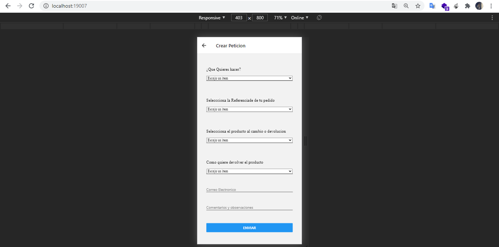

# app-react-native-firebase
Creacion de una app de devoluciones usando react native y la base de datos usando firebase

<h1>Parte inicial</h1>


<h1>Crear Peticion</h1>



<h1>Actualizando Peticion</h1>


<h6>Instalar expo</h6>


<strong>Correr expo por VScode</strong>

```
expo start
```

<strong>Tambien inicializar npm</strong>

```
npm install
npm start
```

<h1>Para ver mas dirigirse a la carpeta de create_project</h1>
